<p align="center">
  
</p>

<h1 align="center">
  <br>
  Todo Enforcement Hook System
  <br>
</h1>

<h4 align="center">
  Never lose track of tasks again. Persistent, intelligent todo management for Claude Code.
</h4>

<p align="center">
  <a href="#key-features">Features</a> •
  <a href="#quick-start">Quick Start</a> •
  <a href="#how-it-works">How It Works</a> •
  <a href="#configuration">Configuration</a> •
  <a href="#commands">Commands</a> •
  <a href="#troubleshooting">Troubleshooting</a>
</p>

<p align="center">
  
  
  
  
  
</p>

<p align="center">
  
  
  
</p>

---

<br>

## The Problem

> *"I asked Claude to create a question paper AND answer key. It created the question paper perfectly... but completely forgot the answer key."*

Sound familiar? During long Claude Code sessions, especially when:
- Reading large files that consume context
- Running `/compact` to free up space
- Resuming sessions after breaks
- Invoking skills with multiple deliverables

**Claude loses track of tasks.** Not anymore.

<br>

## The Solution

```
┌─────────────────────────────────────────────────────────────────────┐
│                                                                     │
│   BEFORE                           AFTER                            │
│   ──────                           ─────                            │
│                                                                     │
│   "Create question paper           "Create question paper           │
│    and answer key"                  and answer key"                 │
│         │                                │                          │
│         ▼                                ▼                          │
│   ┌───────────┐                    ┌───────────┐                    │
│   │  Claude   │                    │  Claude   │                    │
│   │  forgets  │                    │  creates  │                    │
│   │  answer   │                    │   TODO:   │                    │
│   │   key     │                    │ ☐ Q.Paper │                    │
│   └───────────┘                    │ ☐ Ans.Key │                    │
│         │                          └───────────┘                    │
│         ▼                                │                          │
│   😢 Incomplete                          ▼                          │
│                                    ✅ Both delivered                │
│                                                                     │
└─────────────────────────────────────────────────────────────────────┘
```

<br>

## Key Features

<table>
<tr>
<td width="50%">

### 🧠 Intelligent Detection
- Detects skill invocations (`/skill-name`)
- Recognizes task keywords (create, build, implement)
- Injects contextual reminders

</td>
<td width="50%">

### 💾 Persistent State
- Survives `/compact` operations
- Restores on session resume
- Per-project isolation

</td>
</tr>
<tr>
<td width="50%">

### 🛡️ Stop Protection
- Blocks completion if tasks are `in_progress`
- Forces resolution before finishing
- Prevents forgotten deliverables

</td>
<td width="50%">

### ⚡ Zero Configuration
- Works immediately after install
- No manual intervention needed
- Automatic cleanup of old state

</td>
</tr>
<tr>
<td width="50%">

### 🔒 Crash-Safe
- Atomic file operations
- File locking prevents corruption
- Graceful error handling

</td>
<td width="50%">

### 📊 Observable
- Debug logging with rotation
- Health check script
- Comprehensive test suite

</td>
</tr>
</table>

<br>

---

<br>

## Quick Start

### One-Command Install

```bash
# Clone and install
git clone https://github.com/YOUR_USERNAME/claude-todo-hooks.git ~/.claude/hooks/todo-system

# Make executable
chmod +x ~/.claude/hooks/todo-system/*.py ~/.claude/hooks/todo-system/*.sh

# Add to settings (see Configuration section)
```

### Verify Installation

```bash
~/.claude/hooks/todo-system/health_check.sh
```

Expected output:
```
━━━━━━━━━━━━━━━━━━━━━━━━━━━━━━━━━━━━━━━━━━━━━━━━━━━━━━━━━━━━
           TODO HOOK SYSTEM - HEALTH CHECK
━━━━━━━━━━━━━━━━━━━━━━━━━━━━━━━━━━━━━━━━━━━━━━━━━━━━━━━━━━━━

📁 Hook Files:
   ✓ todo_core.py
   ✓ hook_session_start.py
   ✓ hook_user_prompt.py
   ✓ hook_post_todowrite.py
   ✓ hook_pre_compact.py
   ✓ hook_stop.py

━━━━━━━━━━━━━━━━━━━━━━━━━━━━━━━━━━━━━━━━━━━━━━━━━━━━━━━━━━━━
   ✓ ALL CHECKS PASSED
━━━━━━━━━━━━━━━━━━━━━━━━━━━━━━━━━━━━━━━━━━━━━━━━━━━━━━━━━━━━
```

<br>

---

<br>

## How It Works

```mermaid
flowchart TD
    subgraph SESSION["🚀 SESSION LIFECYCLE"]
        START([Session Start]) --> SS[/"SessionStart Hook"/]
        SS --> |Load previous todos| READY([Ready])
    end

    subgraph PROMPT["💬 EACH PROMPT"]
        READY --> USER[/"User submits prompt"/]
        USER --> UP[/"UserPromptSubmit Hook"/]
        UP --> |Skill detected?| SKILL_REMIND["Inject skill reminder"]
        UP --> |Task detected?| TASK_REMIND["Inject task reminder"]
        UP --> |Has todos?| SHOW_TODOS["Show active todos"]
        SKILL_REMIND --> CLAUDE
        TASK_REMIND --> CLAUDE
        SHOW_TODOS --> CLAUDE
        CLAUDE["Claude processes"]
    end

    subgraph TOOLS["🔧 TOOL CALLS"]
        CLAUDE --> |TodoWrite called| TW[/"PostToolUse Hook"/]
        TW --> |Persist| DISK[(Disk State)]
    end

    subgraph STOP["🏁 RESPONSE END"]
        CLAUDE --> STOP_HOOK[/"Stop Hook"/]
        STOP_HOOK --> |in_progress tasks?| BLOCK["🚫 BLOCK"]
        STOP_HOOK --> |all clear| ALLOW["✅ ALLOW"]
        BLOCK --> |must resolve| CLAUDE
    end

    subgraph COMPACT["📦 COMPACTION"]
        COMPACT_CMD[/"/compact command"/] --> PC[/"PreCompact Hook"/]
        PC --> |Save state| DISK
        PC --> SS
    end

    style SS fill:#4CAF50,color:white
    style UP fill:#2196F3,color:white
    style TW fill:#9C27B0,color:white
    style STOP_HOOK fill:#FF5722,color:white
    style PC fill:#FF9800,color:white
    style BLOCK fill:#f44336,color:white
    style ALLOW fill:#4CAF50,color:white
```



### Hook Chain Summary

| Order | Hook | Trigger | Action |
|:-----:|------|---------|--------|
| 1️⃣ | `SessionStart` | Session begins | Load saved todos into context |
| 2️⃣ | `UserPromptSubmit` | Every prompt | Inject reminders based on content |
| 3️⃣ | `PostToolUse` | After TodoWrite | Persist state to disk |
| 4️⃣ | `PreCompact` | Before /compact | Save state for recovery |
| 5️⃣ | `Stop` | Response ends | Block if tasks incomplete |

<br>

---

<br>

## Configuration

Add these hooks to your `~/.claude/settings.json`:

<details>
<summary><b>📋 Click to expand full configuration</b></summary>

```json
{
  "hooks": {
    "SessionStart": [
      {
        "matcher": "startup|resume|compact|clear",
        "hooks": [
          {
            "type": "command",
            "command": "python3 ~/.claude/hooks/todo-system/hook_session_start.py",
            "timeout": 5000
          }
        ]
      }
    ],
    "UserPromptSubmit": [
      {
        "hooks": [
          {
            "type": "command",
            "command": "python3 ~/.claude/hooks/todo-system/hook_user_prompt.py",
            "timeout": 5000
          }
        ]
      }
    ],
    "PostToolUse": [
      {
        "matcher": "TodoWrite",
        "hooks": [
          {
            "type": "command",
            "command": "python3 ~/.claude/hooks/todo-system/hook_post_todowrite.py",
            "timeout": 5000
          }
        ]
      }
    ],
    "PreCompact": [
      {
        "hooks": [
          {
            "type": "command",
            "command": "python3 ~/.claude/hooks/todo-system/hook_pre_compact.py",
            "timeout": 5000
          }
        ]
      }
    ],
    "Stop": [
      {
        "hooks": [
          {
            "type": "command",
            "command": "python3 ~/.claude/hooks/todo-system/hook_stop.py",
            "timeout": 5000
          }
        ]
      }
    ]
  }
}
```

</details>

### Customization Options

Edit `todo_core.py` to adjust:

| Setting | Default | Description |
|---------|:-------:|-------------|
| `MAX_STATE_AGE_DAYS` | `7` | Auto-delete old state files |
| `MAX_LOG_SIZE_MB` | `5` | Debug log rotation threshold |
| `SCHEMA_VERSION` | `1` | For future migrations |

<br>

---

<br>

## Commands

### 📊 Daily Operations

| Command | Description |
|---------|-------------|
| `~/.claude/hooks/todo-system/health_check.sh` | Quick system health check |
| `python3 ~/.claude/hooks/todo-system/test_hooks.py` | Run full test suite |
| `tail -f ~/.claude/todo-state/debug.log` | Watch hooks in real-time |

### 🔧 Maintenance

| Command | Description |
|---------|-------------|
| `cat ~/.claude/todo-state/todos_*.json \| python3 -m json.tool` | View current state |
| `rm -f ~/.claude/todo-state/todos_*.json` | Clear all state |
| `> ~/.claude/todo-state/debug.log` | Clear debug log |

### 🧪 Testing Individual Hooks

<details>
<summary><b>Click to expand test commands</b></summary>

```bash
# Test SessionStart hook
echo '{"source": "resume"}' | \
  python3 ~/.claude/hooks/todo-system/hook_session_start.py

# Test UserPromptSubmit with skill detection
echo '{"prompt": "/neel-study-test create paper"}' | \
  python3 ~/.claude/hooks/todo-system/hook_user_prompt.py

# Test PostTodoWrite persistence
echo '{"tool_name": "TodoWrite", "tool_input": {"todos": [{"content": "Test", "status": "pending", "activeForm": "Testing"}]}}' | \
  python3 ~/.claude/hooks/todo-system/hook_post_todowrite.py

# Test PreCompact
echo '{"trigger": "manual"}' | \
  python3 ~/.claude/hooks/todo-system/hook_pre_compact.py

# Test Stop hook (should allow when no in_progress)
echo '{}' | \
  python3 ~/.claude/hooks/todo-system/hook_stop.py
```

</details>

<br>

---

<br>

## Troubleshooting

<details>
<summary><b>🔴 Hooks not firing</b></summary>

**Symptoms:** No entries in debug log after prompts

**Solutions:**
1. Verify `settings.json` is valid:
   ```bash
   python3 -m json.tool ~/.claude/settings.json > /dev/null && echo "✓ Valid JSON"
   ```
2. Check files are executable:
   ```bash
   ls -la ~/.claude/hooks/todo-system/*.py | grep -E "^-rwx"
   ```
3. Restart Claude Code session

</details>

<details>
<summary><b>🔴 State not persisting</b></summary>

**Symptoms:** Todos lost after compact/resume

**Solutions:**
1. Verify state directory exists:
   ```bash
   ls -la ~/.claude/todo-state/
   ```
2. Check for errors in debug log:
   ```bash
   grep -i "error\|fail" ~/.claude/todo-state/debug.log
   ```
3. Ensure PostToolUse hook is registered for `TodoWrite` matcher

</details>

<details>
<summary><b>🔴 Stop hook not blocking</b></summary>

**Symptoms:** Claude finishes despite in_progress tasks

**Solutions:**
1. Verify Stop hook is in settings.json
2. Check debug log:
   ```bash
   grep "Stop hook" ~/.claude/todo-state/debug.log | tail -5
   ```
3. Test manually:
   ```bash
   echo '{}' | python3 ~/.claude/hooks/todo-system/hook_stop.py
   ```

</details>

<details>
<summary><b>🔴 Hook timeout errors</b></summary>

**Symptoms:** "Hook timed out" messages

**Solutions:**
1. Increase timeout in settings.json (default: 5000ms)
2. Check disk I/O performance
3. Review debug log for bottlenecks

</details>

<details>
<summary><b>🔴 Debug log growing too large</b></summary>

**Symptoms:** Disk space consumption

**Solutions:**
1. Log auto-rotates at 5MB (configurable)
2. Manual clear: `> ~/.claude/todo-state/debug.log`

</details>

<br>

---

<br>

## Architecture

<details>
<summary><b>📁 File Structure</b></summary>

```
~/.claude/
├── hooks/
│   └── todo-system/
│       ├── todo_core.py           # Core module (state, atomic ops, validation)
│       ├── hook_session_start.py  # Load todos on session start
│       ├── hook_user_prompt.py    # Inject reminders per prompt
│       ├── hook_post_todowrite.py # Persist after TodoWrite
│       ├── hook_pre_compact.py    # Save before compact
│       ├── hook_stop.py           # Block if incomplete
│       ├── test_hooks.py          # Comprehensive test suite
│       ├── health_check.sh        # Quick health check
│       ├── ARCHITECTURE.md        # Detailed technical docs
│       └── README.md              # This file
│
├── todo-state/
│   ├── todos_<hash>.json          # Per-project state files
│   └── debug.log                  # Hook execution logs
│
└── settings.json                  # Hook configuration
```

</details>

<details>
<summary><b>💾 State File Format</b></summary>

```json
{
  "schema_version": 1,
  "project_id": "0676fe55db2eb0ed",
  "project_name": "my-project",
  "todos": [
    {
      "content": "Task description",
      "status": "pending | in_progress | completed",
      "activeForm": "Present tense action"
    }
  ],
  "created_at": "2026-01-17T14:30:00",
  "updated_at": "2026-01-17T14:35:00",
  "session_id": "abc123"
}
```

</details>

<details>
<summary><b>🔒 Safety Guarantees</b></summary>

| Protection | Implementation |
|------------|----------------|
| **Crash-safe writes** | Temp file → fsync → atomic rename |
| **Race prevention** | fcntl file locking (LOCK_EX/LOCK_SH) |
| **Data validation** | Schema validation on every load |
| **Loop prevention** | `stop_hook_active` flag check |
| **Disk protection** | 7-day cleanup, 5MB log rotation |
| **Project isolation** | SHA256 hash of project path |

</details>

<br>

---

<br>

## Performance

| Metric | Value | Note |
|--------|:-----:|------|
| Hook execution | ~80-95ms | Per hook |
| Per-prompt overhead | ~170ms | UserPrompt + Stop |
| State file size | <1KB | Per project |
| Debug log max | 5MB | Auto-rotates |
| Memory usage | Negligible | No persistent processes |

<br>

---

<br>

## Contributing

Contributions are welcome! Please:

1. Fork the repository
2. Create a feature branch (`git checkout -b feature/amazing-feature`)
3. Run the test suite (`python3 test_hooks.py`)
4. Commit your changes (`git commit -m 'Add amazing feature'`)
5. Push to the branch (`git push origin feature/amazing-feature`)
6. Open a Pull Request

### Development Setup

```bash
# Clone your fork
git clone https://github.com/YOUR_USERNAME/claude-todo-hooks.git

# Run tests
python3 test_hooks.py

# Run health check
./health_check.sh
```

<br>

---

<br>

## FAQ

<details>
<summary><b>Will this slow down Claude Code?</b></summary>

No. The total overhead is ~170ms per prompt (UserPromptSubmit + Stop hooks), which is imperceptible. Hooks run in parallel where possible.

</details>

<details>
<summary><b>Does it work with all Claude Code versions?</b></summary>

Tested with Claude Code 2.0.74+. Should work with any version that supports the hooks API.

</details>

<details>
<summary><b>What happens if a hook crashes?</b></summary>

All hooks have try/except wrappers and exit gracefully. Errors are logged but never block Claude Code operation.

</details>

<details>
<summary><b>Can I use this with multiple projects?</b></summary>

Yes! Each project gets its own state file based on a SHA256 hash of the project path. Complete isolation.

</details>

<details>
<summary><b>How do I disable temporarily?</b></summary>

Remove or comment out the hooks in `~/.claude/settings.json`. No code changes needed.

</details>

<br>

---

<br>

<p align="center">
  <b>Made with ❤️ by Claude & Rajesh </b>
</p>

<p align="center">
  <a href="#todo-enforcement-hook-system">⬆ Back to Top</a>
</p>

<p align="center">
  <sub>If this helped you, consider giving it a ⭐</sub>
</p>
