# Todo Enforcement Hook System - Architecture Document

## Documentation Compliance Review

### Verification Against Claude Code Docs

| Aspect | Docs Specification | Our Implementation | Status |
|--------|-------------------|-------------------|--------|
| **Hook JSON Structure** | Nested arrays with matcher/hooks | Exactly matches | ✅ |
| **SessionStart source values** | `startup\|resume\|clear\|compact` | `startup\|resume\|compact\|clear` | ✅ |
| **Stop hook decision** | `{"decision": "block", "reason": "..."}` | Exactly matches | ✅ |
| **Stop hook loop prevention** | `stop_hook_active` field in input | Checked via `input_data.get()` | ✅ |
| **Context injection** | `hookSpecificOutput.additionalContext` | Exactly matches | ✅ |
| **PostToolUse input** | `tool_name`, `tool_input` fields | Both read correctly | ✅ |
| **UserPromptSubmit input** | `prompt` field | Read via `input_data.get("prompt")` | ✅ |
| **Exit codes** | 0=success, 2=blocking error | All hooks exit 0, use JSON for blocking | ✅ |
| **Timeout** | Configurable per hook | Set to 5000ms for all our hooks | ✅ |

### Hook Input/Output Formats (Verified)

**SessionStart Input:**
```json
{
  "session_id": "abc123",
  "source": "startup|resume|compact|clear",
  "cwd": "/path/to/project",
  "permission_mode": "default"
}
```

**UserPromptSubmit Input:**
```json
{
  "session_id": "abc123",
  "prompt": "user's message text",
  "cwd": "/path/to/project"
}
```

**PostToolUse Input (for TodoWrite):**
```json
{
  "session_id": "abc123",
  "tool_name": "TodoWrite",
  "tool_input": {
    "todos": [
      {"content": "Task", "status": "pending", "activeForm": "Working"}
    ]
  }
}
```

**Stop Input:**
```json
{
  "session_id": "abc123",
  "stop_hook_active": false
}
```

**Context Injection Output (SessionStart/UserPromptSubmit):**
```json
{
  "hookSpecificOutput": {
    "hookEventName": "SessionStart",
    "additionalContext": "Text to inject into context"
  }
}
```

**Blocking Output (Stop):**
```json
{
  "decision": "block",
  "reason": "Explanation shown to Claude"
}
```

---

## Complete System Flow

```mermaid
flowchart TD
    subgraph SESSION["SESSION LIFECYCLE"]
        START([Session Start]) --> SS_HOOK

        SS_HOOK{{"SessionStart Hook<br/>hook_session_start.py"}}
        SS_HOOK -->|source=startup| CLEANUP["Run cleanup_old_states()"]
        SS_HOOK -->|source=resume/compact| SKIP_CLEANUP["Skip cleanup"]
        CLEANUP --> LOAD_TODOS["Load todos from disk"]
        SKIP_CLEANUP --> LOAD_TODOS
        LOAD_TODOS --> INJECT_CONTEXT["Inject <session-restored><br/>with previous todos"]
        INJECT_CONTEXT --> READY([Ready for Prompts])
    end

    subgraph PROMPT["EACH USER PROMPT"]
        READY --> USER_INPUT[/"User submits prompt"/]
        USER_INPUT --> UP_HOOK

        UP_HOOK{{"UserPromptSubmit Hook<br/>hook_user_prompt.py"}}
        UP_HOOK --> TRIVIAL_CHECK{"Is trivial prompt?<br/>(hi, yes, no, etc.)"}
        TRIVIAL_CHECK -->|Yes| NO_INJECT["No injection"]
        TRIVIAL_CHECK -->|No| SKILL_CHECK{"Contains /skill-name?"}

        SKILL_CHECK -->|Yes| SKILL_REMIND["Inject <skill-todo-enforcement><br/>MANDATORY: Use TodoWrite first"]
        SKILL_CHECK -->|No| TASK_CHECK{"Contains task indicators?<br/>(create, build, implement...)"}

        TASK_CHECK -->|Yes| TASK_REMIND["Inject <todo-reminder><br/>Multi-step task detected"]
        TASK_CHECK -->|No| SHOW_TODOS["Show <active-todos><br/>if any exist"]

        SKILL_REMIND --> CLAUDE_PROCESS
        TASK_REMIND --> CLAUDE_PROCESS
        SHOW_TODOS --> CLAUDE_PROCESS
        NO_INJECT --> CLAUDE_PROCESS

        CLAUDE_PROCESS["Claude processes prompt"]
    end

    subgraph TOOLS["TOOL EXECUTION"]
        CLAUDE_PROCESS --> TOOL_CALL{"Claude calls tool?"}
        TOOL_CALL -->|No| RESPONSE
        TOOL_CALL -->|Yes| WHICH_TOOL{"Which tool?"}

        WHICH_TOOL -->|TodoWrite| TW_EXECUTE["Execute TodoWrite"]
        WHICH_TOOL -->|Other| OTHER_EXECUTE["Execute other tool"]

        TW_EXECUTE --> PT_HOOK
        PT_HOOK{{"PostToolUse Hook<br/>hook_post_todowrite.py"}}
        PT_HOOK --> PERSIST["Persist todos to disk<br/>~/.claude/todo-state/"]
        PERSIST --> RESPONSE

        OTHER_EXECUTE --> RESPONSE
    end

    subgraph STOP["RESPONSE COMPLETION"]
        RESPONSE["Claude generates response"]
        RESPONSE --> STOP_HOOK

        STOP_HOOK{{"Stop Hook<br/>hook_stop.py"}}
        STOP_HOOK --> LOOP_CHECK{"stop_hook_active?"}
        LOOP_CHECK -->|Yes| ALLOW_STOP["Allow stop<br/>(prevent infinite loop)"]
        LOOP_CHECK -->|No| IP_CHECK{"Any in_progress todos?"}

        IP_CHECK -->|Yes| BLOCK["BLOCK STOP<br/>Return decision=block<br/>with task list"]
        IP_CHECK -->|No| PENDING_CHECK{"Any pending todos?"}

        PENDING_CHECK -->|Yes| LOG_WARN["Log warning<br/>Allow stop"]
        PENDING_CHECK -->|No| ALLOW_STOP

        BLOCK --> CLAUDE_PROCESS
        LOG_WARN --> DONE([Response Complete])
        ALLOW_STOP --> DONE
    end

    subgraph COMPACT["CONTEXT COMPACTION"]
        COMPACT_TRIGGER[/"User runs /compact<br/>or auto-compact"/]
        COMPACT_TRIGGER --> PC_HOOK

        PC_HOOK{{"PreCompact Hook<br/>hook_pre_compact.py"}}
        PC_HOOK --> SAVE_STATE["Save state with metadata<br/>last_compact=true"]
        SAVE_STATE --> DO_COMPACT["Context compacted"]
        DO_COMPACT --> SS_HOOK
    end

    style SS_HOOK fill:#4CAF50,color:white
    style UP_HOOK fill:#2196F3,color:white
    style PT_HOOK fill:#9C27B0,color:white
    style STOP_HOOK fill:#F44336,color:white
    style PC_HOOK fill:#FF9800,color:white
    style BLOCK fill:#F44336,color:white
    style SKILL_REMIND fill:#4CAF50,color:white
    style TASK_REMIND fill:#4CAF50,color:white
```



---

## Hook Chain Summary

```
┌─────────────────────────────────────────────────────────────────────────────┐
│                           SESSION START                                      │
│  SessionStart Hook → Load previous todos → Inject into context              │
└─────────────────────────────────────────────────────────────────────────────┘
                                    │
                                    ▼
┌─────────────────────────────────────────────────────────────────────────────┐
│                          USER PROMPT                                         │
│  UserPromptSubmit Hook → Detect skill/task → Inject appropriate reminder    │
└─────────────────────────────────────────────────────────────────────────────┘
                                    │
                                    ▼
┌─────────────────────────────────────────────────────────────────────────────┐
│                         CLAUDE PROCESSING                                    │
│  Claude reads context with todos → Processes prompt → Calls tools           │
└─────────────────────────────────────────────────────────────────────────────┘
                                    │
                                    ▼
┌─────────────────────────────────────────────────────────────────────────────┐
│                         TOOL EXECUTION                                       │
│  If TodoWrite → PostToolUse Hook → Persist to disk atomically              │
└─────────────────────────────────────────────────────────────────────────────┘
                                    │
                                    ▼
┌─────────────────────────────────────────────────────────────────────────────┐
│                         RESPONSE COMPLETION                                  │
│  Stop Hook → Check in_progress todos → BLOCK if any, else allow            │
└─────────────────────────────────────────────────────────────────────────────┘
                                    │
              ┌─────────────────────┴─────────────────────┐
              │                                           │
              ▼                                           ▼
┌─────────────────────────────┐             ┌─────────────────────────────────┐
│    BLOCKED → Continue       │             │    ALLOWED → Response shown     │
│    Claude resolves todos    │             │    User can send next prompt    │
└─────────────────────────────┘             └─────────────────────────────────┘
```

---

## State Persistence Architecture

```
~/.claude/
├── hooks/
│   └── todo-system/
│       ├── todo_core.py           # Core module (atomic ops, validation)
│       ├── hook_session_start.py  # Load on startup/resume/compact
│       ├── hook_user_prompt.py    # Remind on each prompt
│       ├── hook_post_todowrite.py # Persist after TodoWrite
│       ├── hook_pre_compact.py    # Save before compact
│       └── hook_stop.py           # Block if in_progress
│
├── todo-state/
│   ├── todos_<project_hash>.json  # Per-project state files
│   └── debug.log                  # Hook execution logs
│
└── settings.json                  # Hook configuration
```

### State File Format
```json
{
  "schema_version": 1,
  "project_id": "0676fe55db2eb0ed",
  "project_name": "my-project",
  "todos": [
    {
      "content": "Task description",
      "status": "pending|in_progress|completed",
      "activeForm": "Working on task"
    }
  ],
  "created_at": "2026-01-17T14:30:00",
  "updated_at": "2026-01-17T14:35:00",
  "session_id": "abc123",
  "last_compact": false,
  "compact_trigger": null
}
```

---

## Safety Features

### 1. Atomic File Operations
- Write to temp file first
- fsync() to ensure data on disk
- Rename (atomic on POSIX)
- Cleanup temp on error

### 2. File Locking
- fcntl.LOCK_EX for exclusive writes
- fcntl.LOCK_SH for shared reads
- Prevents race conditions

### 3. Schema Validation
- Required fields: content, status, activeForm
- Valid statuses: pending, in_progress, completed
- Invalid todos filtered out

### 4. Loop Prevention
- Stop hook checks `stop_hook_active` flag
- Prevents infinite blocking loop

### 5. Per-Project Isolation
- SHA256 hash of project path
- Each project has separate state file

### 6. Auto-Cleanup
- States older than 7 days removed
- Runs on startup only (not every resume)
- Debug log rotated at 5MB

---

## Version
- **System Version:** 2.0.0
- **Created:** 2026-01-17
- **Last Updated:** 2026-01-17
- **Docs Compliance:** Claude Code 2.0.74+
